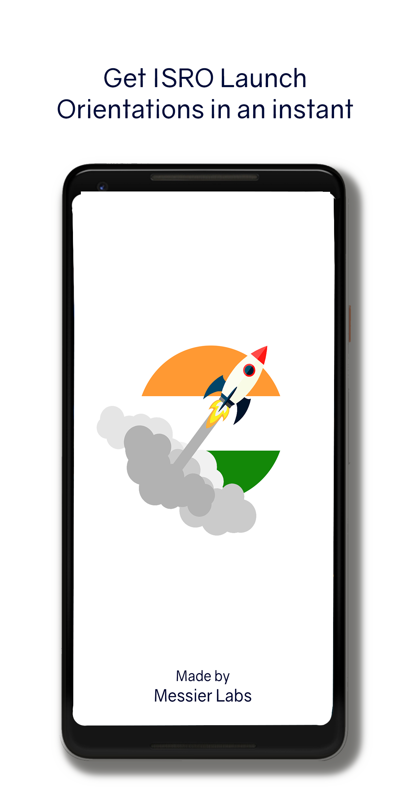
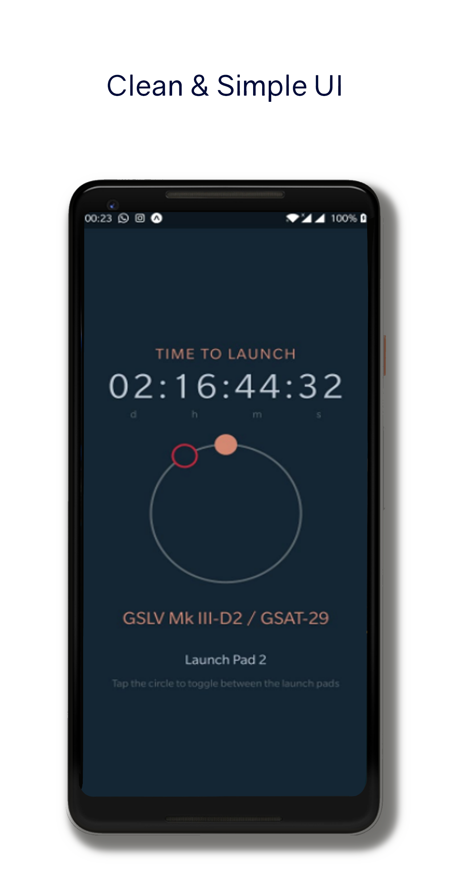
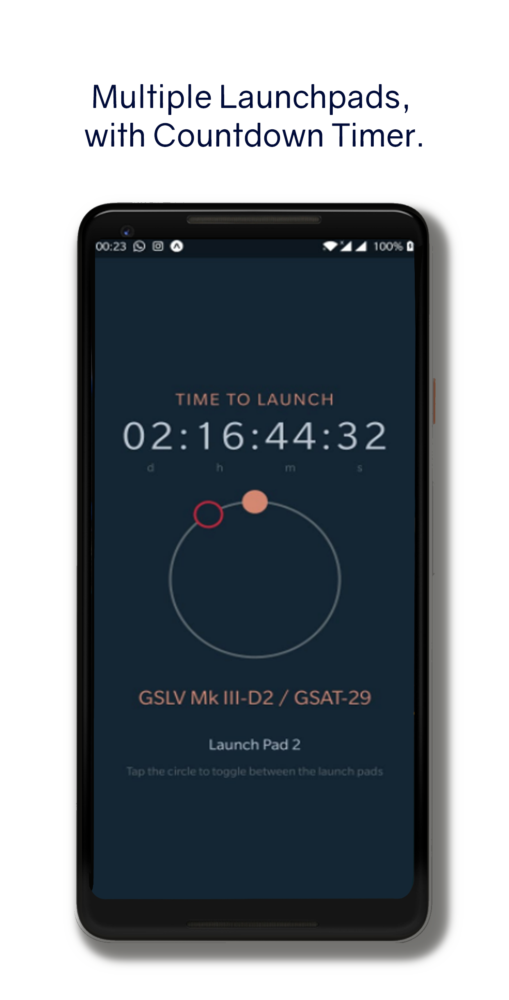

# Rocket Spot

An app that provides orientation information based on your current location to spot rockets launched from Satish Dhawan Space Center, Sriharikota (SDSC-SHAR).

We appreciate any feedback. Feel free to file issues or request new features.

[Download From the Play Store](https://play.google.com/store/apps/details?id=com.messierlabs.rocketspot)

### Screenshots

### License
MIT © [Messier Labs](https://github.com/Messier-Labs)
